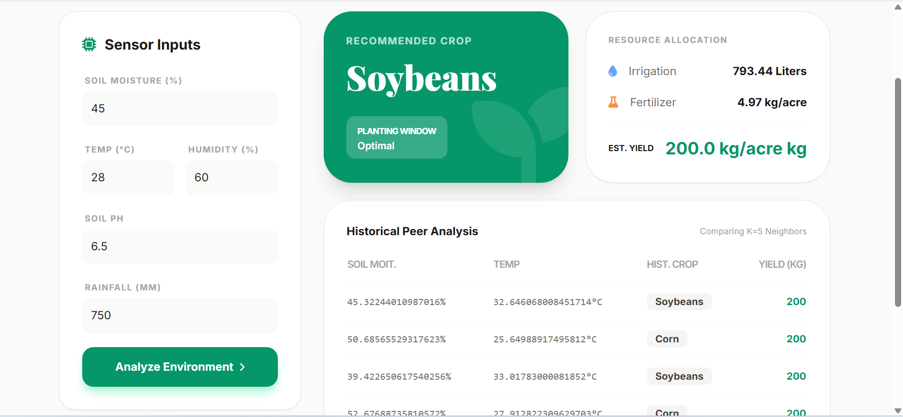

# Agri Intelligent System — AI-Powered Agricultural Recommendation Engine

##  Overview

The **Agri Intelligent System** is an AI-powered agricultural decision-support platform that leverages **K-Nearest Neighbors (KNN)** machine learning algorithms to analyze real-time soil and weather sensor data. It provides farmers and agricultural analysts with smart, data-driven recommendations to maximize crop yield and optimize resource usage.
# Dashboard Screenshot


---

##  Features

- 🌱 **Crop Classification** — Recommends the optimal crop based on soil & climate conditions
- 📈 **Yield Prediction** — Estimates expected yield in kg/acre
- 💧 **Irrigation Planning** — Calculates precise water requirements in liters
- 🧪 **Fertilizer Strategy** — Suggests the right fertilizer quantity in kg/acre
- 🌡️ **Planting Window Alert** — Flags sub-optimal temperature conditions in real time
- 🔍 **Historical Peer Matching** — Explains AI predictions using similar past records (Explainability)

---

## 🛠️ Tech Stack

| Component        | Technology              |
|------------------|-------------------------|
| Backend          | Python, Flask           |
| ML Algorithm     | KNN (Classifier + Regressor) |
| Data Handling    | Pandas, NumPy           |
| Model Persistence| Joblib                  |
| Frontend         | HTML Dashboard          |
| Scaling          | StandardScaler (Scikit-learn) |

---


##  Dataset Information

The system is trained on a clean agricultural dataset containing the following features:

| Feature               | Description                        |
|-----------------------|------------------------------------|
| `soil_moisture`       | Soil moisture percentage           |
| `avg_temp`            | Average temperature (°C)           |
| `humidity`            | Humidity percentage                |
| `soil_ph`             | Soil pH value                      |
| `rainfall_mm`         | Rainfall in millimeters            |
| `optimal_crop`        | Target crop label (Classification) |
| `expected_yield_kg`   | Expected yield in kg (Regression)  |
| `irrigation_needed_liters` | Water requirement in liters   |
| `fertilizer_req_kg`   | Fertilizer requirement in kg       |

> ✅ **Note:** The dataset is pre-cleaned — no additional preprocessing is required.

---

## ML Model Details

| Model | Algorithm | Task | Neighbors |
|-------|-----------|------|-----------|
| Crop Classifier | KNeighborsClassifier | Multi-class Classification | 7 (distance-weighted) |
| Yield Regressor | KNeighborsRegressor | Multi-output Regression | 5 (distance-weighted) |

---

## Requirements

```
flask
pandas
numpy
scikit-learn
joblib
```

Generate using:
```bash
pip freeze > requirements.txt
```

---

## How It Works

```
Sensor Data Input
      ↓
StandardScaler (Feature Normalization)
      ↓
KNN Classifier → Optimal Crop Recommendation
KNN Regressor  → Yield / Irrigation / Fertilizer Prediction
      ↓
JSON API Response + Historical Peer Matching
```

---

## 👨‍💻 Author

**Chandan**
-  GitHub: 7735Chandanjena

---

> 💡 *"Empowering farmers with AI-driven insights for smarter, sustainable agriculture."*
